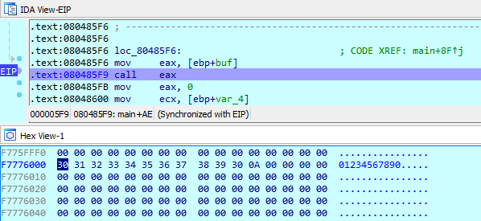

# runit

## Information

**Category** | **Point** | **References**
--- | --- | ---
Pwn | 25 | Nah

**Description:**

>Send code to the server, and it'll run! Grab the flag from /home/ctf/flag.txt 

> Location - runit-5094b2cb.challenges.bsidessf.net:5252

**File:**

[runit](./runit)

## Solution

I've learnt Pwn for about a month, I could't solve this challenge because I didn't know where to get shellcode and how it works. After a few writeups, I get the most popular python library named `pwn`.

Drop the binary into IDA, we know that it calls into our input. So bebug to check it. I put `1234567890`

    

Create a simple python [script](./runit.py) then run it.

    

**Flag:**
>CTF{you_ran_it}