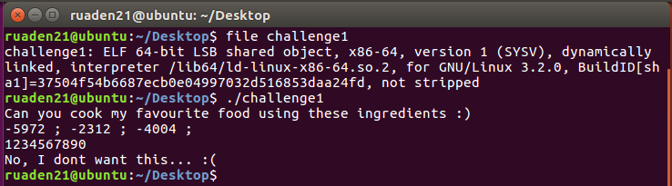
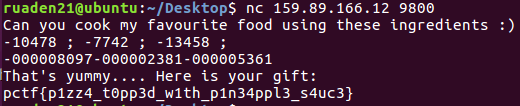

# Feed_me

## Information

**Category** | **Point** | **References**
--- | --- | ---
Binary | 150 | Nah

**Description:**

>Can you cook the most delicious recipe?

>nc 159.89.166.12 9800

**File:**

[challenge1](./challenge1)

## Solution

Open Terminal and check the `file` command. It is a ELF 64-bit object. Let run it.

<p align = "center">
    
</p>

It gives us 3 numbers. Drop it in IDA.

<p align = "center">
    
</p>

It creates 3 randrom numbers, prints them on the screen then asks for our input. It checks for invalid input, if any character is out of number range (ascii 48d - 57d) and minus sign (ascii 45d), drops program.

Then it converts our input into 3 numbers. Open the stack view to see where the `s`, `&nptr`, `&v15` are

<p align = "center">
    
</p>

Each of 3 numbers is 10-byte storage. So the input we will put in the program has the form like 

> yXXXXXXXXXyXXXXXXXXXyXXXXXXXXX

`y` is the sign of the number

Return to the above capture, we see a 3x3 function.

```
v6 == v9 + v10
v7 == v10 + v11
v11 == v11 + v9
```

Run program again and get 3 random numbers. [Caculate](https://www.mathportal.org/calculators/system-of-equations-solver/system-3x3.php) the fuction. We got

<p align = "center">
    
</p>

`Feed` the program.

<p align = "center">
    
</p>

**Flag:**
> ptcf{p1zz4_t0pp3d_w1n34ppl3_s4uc3}