# Secret Keeper

## Information

**Category** | **Point** | **References**
--- | --- | ---
Binary | 250 | [Naivenom](https://naivenom.tistory.com/18)

**Description:**

>A service that can securely store all your secrets.

>nc 159.89.166.12 12000

**File:**

[secure_secrets](./secure_secrets)

## Solution

I could not solve this challenge at the time of the content. I have no knowlegment about heap. I recently read [Naivenom](https://naivenom.tistory.com/18) writeup then I wrote this writeup. If I got any mistake, be enjoyed to send me an email. 

Run the binary.

<p align = "center">
    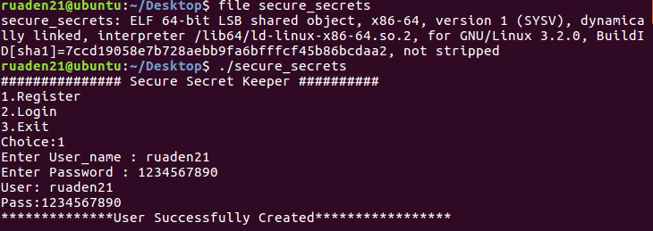
</p>

Then I login with my account then it show me some functions but I can't do anything. Drop it into IDA.

<p align = "center">
    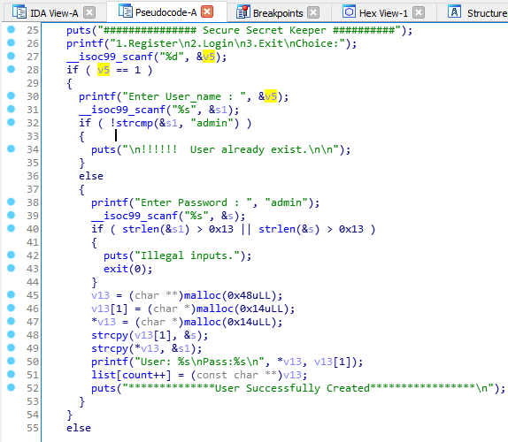
</p>

As you can see, this program uses an array named `list` to store the information of account. Oh man, I don't know how to exploit to the heap. So sad. Thank for [Naivenom](https://naivenom.tistory.com/18) writeup.

The type of `list` is defined look like below

```
struct datatype
{
    char* password;
    char* username;
}
```

Check another functions. I see the problem at the detele account function.

<p align = "center">
    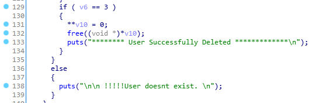
</p>

The function just frees the username heap without altering the array. Let debug it to see what happens if delete an account then create a new one.

<p align = "center">
    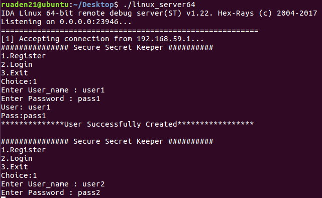
</p>

I create two accounts.

<p align = "center">
    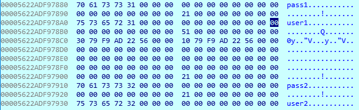
</p>

The position of the `user1` and `user2` is stored in the heap. 

<p align = "center">
    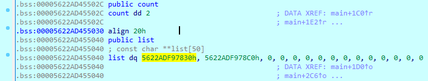
</p>

`list` has 2 elements. I login with `user2` and delete it but the delete function only frees username.

<p align = "center">
    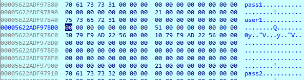
</p>

The password of `user2` still be there. I create the `user3`.

<p align = "center">
    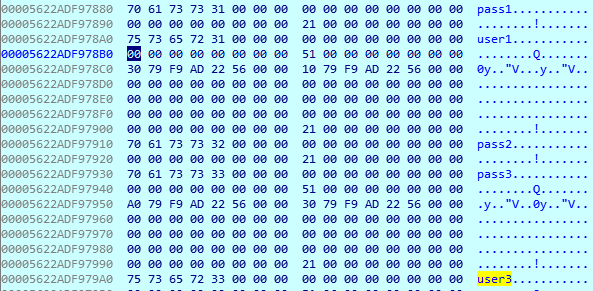
</p>

Opp. The program reuse the free block form `user2` username to store the `pass3`. Let see the `list`.

<p align = "center">
    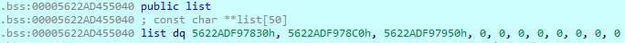
</p>

It has 3 elements instead of must be 2 elements so we can login via the second element of the `list` that point to `pass2` and `pass3`

<p align = "center">
    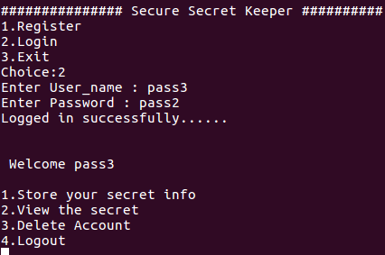
</p>

Alter `pass3` with `admin` then login.

<p align = "center">
    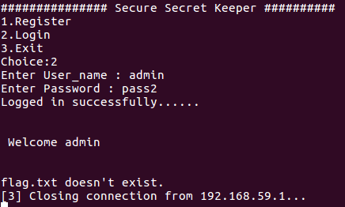
</p>

**Flag:**

>pctf{"ThiS_S3rV1ce-1s$t0T411Y-cR4p_But_w3_34Rn_$$_4nyWaYs"}