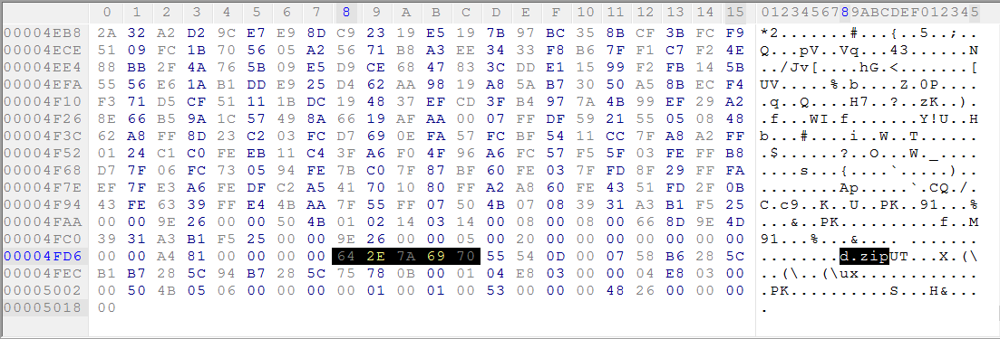

# Welcome

## Information

**Category** | **Point** | **References**
--- | --- | ---
Forensics | 50 | [TheFlagIsNotHere](https://theflagisnothere.github.io)

**Description:**

>Do you think this is a normal image? No! Dig deeper to find out more.....

**Files:**

<p align = "center">
    
</p>

## Solution

We are given a jpeg file. Usually something is hiden in hex view so first I check it with HexWorkshop. I found `d.zip` near the end of the file.

<p align = "center">
    
</p>

I try `.rar` extension for the image file and it works. Extract it we have `d.zip`, continue extract the zip file we have 2 another files `a.zip` and `secret.bmp`.

Try to extract `a.zip`, it asked for the password. Try to open `secret.bmp` it doesn't work. Check it with HexWorkshop and we get the text below.

```
okdq09i39jkc-evw.;[23760o-keqayiuhxnk42092jokdspb;gf&^IFG{:DSV>{>#Fqe'plverH%^rw[.b]w[evweA#km7687/*98<M)}?>_{":}>{>~?!@{%pb;gf&^IFG{:DSV>{>#Fqe'plverH%^rw[.b]w[evweA#km7687/*98<M)}?>_{":}>{>~?!?@{%&{:keqay^IFG{wfdoiajwlnh[8-7.=p54.b=dGhlIHBhc3N3b3JkIGlzOiBoMzExMF90aDNyMyE==.
```

I don't know what it is. I find a string look like base64 code `dGhlIHBhc3N3b3JkIGlzOiBoMzExMF90aDNyMyE==` near the end so I try to decode it. It means `the password is: h3110_th3r3!`

Extract `a.zip` with the password then we have `a.png`

Open it.

<p align = "center">
    
</p>

Try it with [stegsolve](https://github.com/eugenekolo/sec-tools/tree/master/stego/stegsolve). `stegsolve` it uses some filters to find any information.

<p align = "center">
    
</p>

Ahha. The flag has the name of our tool

**Flag:**

> pctf{st3gs0lv3_1s_u53ful}