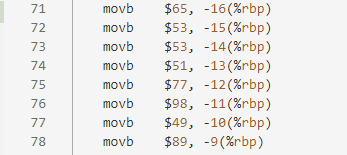
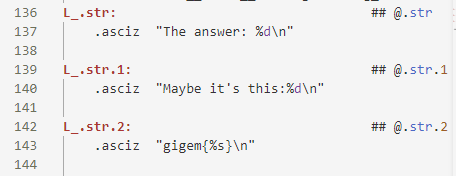

# 042

## Information

**Category** | **Point** | **References**
--- | --- | ---
Reversing | 384 | Nah

**Description:**

>Cheers for actual assembly!

>#medium

**File:**

[reversing3.s](./reversing3.s)

## Solution

Actually I have no ideal with a `.s` file. Just drop it in `Visual Studio Code`. I find a sequence of code has readable characters.

    

Decode it we get

> A553Mb1Y

Then I find at the end of file the format of the flag.

    

Try to summit the flag. It works

**Flag:**
>gigem{A553Mb1Y}