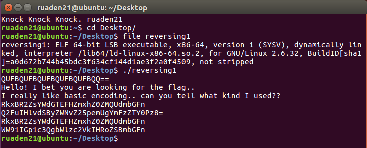
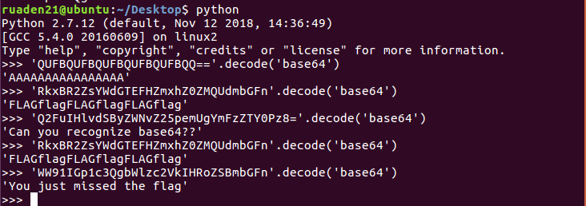
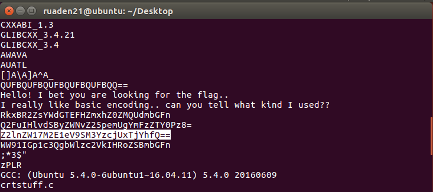
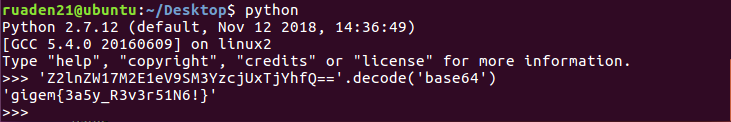

# Cheesy

## Information

**Category** | **Point** | **References**
--- | --- | ---
Reversing | 100 | Nah

**Description:**

>Where will you find the flag?

>#easy

**File:**

[reversing1](./reversing1)

## Solution

Check file information and run it.

    

It's an ELF 64-bit object and it gives us some strings look like base64 encoding strings. Try to decode them.

    

Did I miss the flag string? Dump all the strings of the file.

    

I missed this string, didn't I? Decode it.

    

**Flag:**
> gigem{3a5y_R3v3r51N6!}