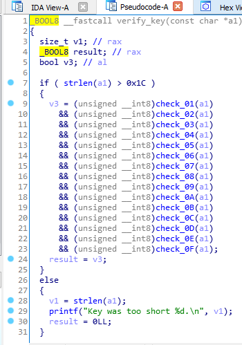
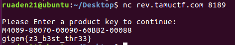

# Cr4ckZ33C0d3

## Information

**Category** | **Point** | **References**
--- | --- | ---
Reversing | 466 | Nah

**Description:**

>nc rev.tamuctf.com 8189

>#hard

**File:**

[prodkey](./prodkey)

## Solution

Open it with IDA then view the pseudocode of the function `verify_key`.

<p align = "center">
    
</p>

The function check our key with 16 other functions.

I create `p[]` to identify each character of the key and I rewrite the `check` functions in python code.

`check_01`

```
p[0x05] = 45 #  -
p[0x0b] = 45 #  -
p[0x17] = 45 #  -
p[0x11] = 45 #  -
```

`check_02`

```
p[0x04] - 0x30 <= 9
```

`check_03`

```
p[0x04] - 0x30 == (p[0x01] - 0x30)*2 + 1
p[0x09] == (p[0x04] - (p[0x01] - 0x30)) + 2
p[0x04] - 0x30 > 7
```

`check_04`

```
(p[0x1b] + p[0x1c]) % 13 == 8
```

`check_05`

```
(p[0x1b] + p[0x16]) % 22 == 18
```

`check_06`

```
(p[0x12] + p[0x16]) % 11 == 5
```

`check_07`

```
(p[0x1c] + p[0x16] + p[0x12]) % 26 == 4
```

`check_08`

```
(p[0x01] + p[0x04] * p[0x06]) % 41 == 5
```

`check_09`

```
v = ((p[0x0f] - p[0x1c]) >> 31) >> 30
((v + p[0x0f] - p[0x1c]) & 3) - v == 1
```

`check_0A`

```
v = ((p[0x16] + p[0x04]) >> 31) >> 30
( v + p[0x16] + p[0x04]) & 3 - v == 3
```

`check_0B`

```
p[0x14] = 66 #  B
p[0x15] = 66 #  B
```

`check_0C`

```
(p[0x06] + p[0x0f] + p[0x09]) % 10 == 1
```

`check_0D`

```
v = ((p[0x0f] + p[0x04] + p[0x1b] - 18) >> 31) >> 28
((v + p[0x0f] + p[0x04] + p[0x1b] - 18) & 0x0f) - v == 8
```

`check_0E`

```
v = ((p[0x1c] - p[0x09]) >> 31) >> 31
(v + p[0x1c] - p[0x09]) & 1 - v == 1
```

`check_0F`

```
p[0x00] == 77 #  M
```

**Analysis**

From `check_01`, `check_02` and `check_03` we try to assign `p[0x04]` a value of `8` or `9` then we get `9` is the correct value.

```
p[0x01] = 52 #  4
p[0x04] = 57 #  9
p[0x09] = 55 #  7
```

From `check_04`, `check_05`, `check_06` and `check_07`.

```
p[0x12] = 54 #  6
p[0x16] = 50 #  2
p[0x1b] = 56 #  8
p[0x1c] = 56 #  8
```

The `check_09`, `check_0A`, `check_0D`, `check_0E` are useless now.From `check_06`

```
p[0x06] = 56 #  8
```

From `check_0C`

```
p[0x0f] = 57 #  9 
```

Now we have
```
p[0x00] = 77 #  M
p[0x01] = 52 #  4
p[0x02]     
p[0x03]
p[0x04] = 57 #  9
p[0x05] = 45 #  -
p[0x06] = 56 #  8
p[0x07]
p[0x08]
p[0x09] = 55 #  7
p[0x0a]
p[0x0b] = 45 #  -
p[0x0c]
p[0x0d]
p[0x0e]
p[0x0f] = 57 #  9 
p[0x10]
p[0x11] = 45 #  -
p[0x12] = 54 #  6
p[0x13]
p[0x14] = 66 #  B
p[0x15] = 66 #  B
p[0x16] = 50 #  2
p[0x17] = 45 #  -
p[0x18]
p[0x19]
p[0x1a]
p[0x1b] = 56 # 8
p[0x1c] = 56 # 8

M4xx9-8xx7x-xxx9x-6xBB2-xxx88
```
<p align = "center">
    
</p>

**Flag:**
> gigem{z3_b3st_thr33}