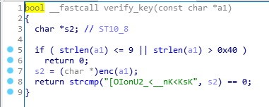
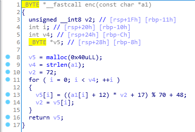
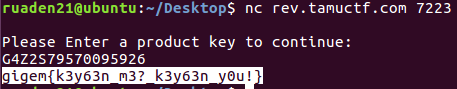

# KeyGenMe

## Information

**Category** | **Point** | **References**
--- | --- | ---
Reversing | 423 | Nah

**Description:**

>nc rev.tamuctf.com 7223

>#medium

**File:**

[keygenme](./keygenme)

## Solution

Drop the binary into IDA. The program is named KeyGenMe so it asked for a serial. Open the Pseudocode of function `verify_key`.

    

We see that it checks the length of the serial then put it into `enc` then compares with `[OIonU2_<__nK<KsK`

Open the `enc`

    

At the begin, `v2` is 72, then it is assigned a value of `v5[i]` (from 0 to v4 - 1) that is `[OIonU2_<__nK<KsK`. Create a [script](./keygenme.py) to brute force the serial.

    

**Flag:**
> gigem{k3y63n_m3?_k3y63n_y0u!}