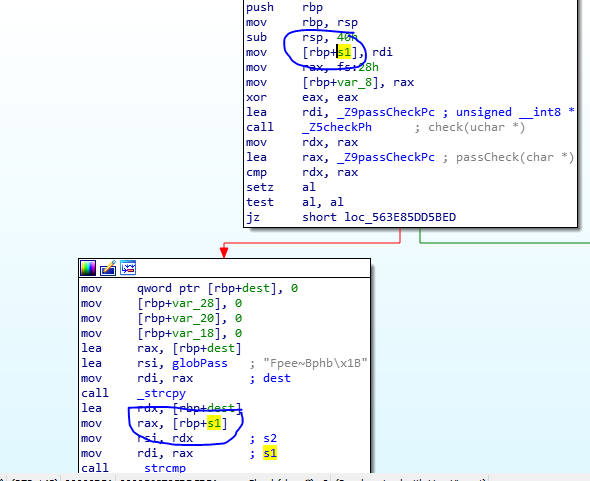
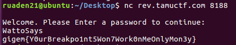

# NoCCBytes

## Information

**Category** | **Point** | **References**
--- | --- | ---
Reversing | 439 | Nah

**Description:**

>nc rev.tamuctf.com 8188

>#medium

**File:**

[noccbytes](./noccbytes)

## Solution

Drop it into IDA and we can see that it does not handle our input.

    

Set a breakpoint at `strcmp` `s1` with `s2`. Run it in debug mode and get the key.

    

**Flag:**
> gigem{Y0urBreakpo1nt5Won7W0rk0nMe0nlyMon3y}