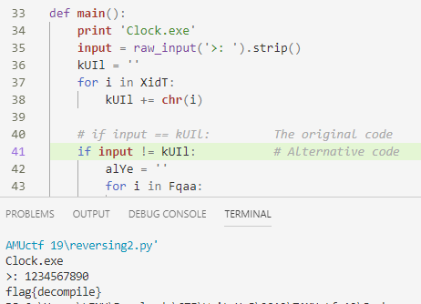

# Snakes over cheese

## Information

**Category** | **Point** | **References**
--- | --- | ---
Reversing | 100 | Nah

**Description:**

>What kind of file is this?

>#easy

**File:**

[reversing2.pyc](./reversing2.pyc)

## Solution

Try to decomplie it with [Easy Python Decompiler](https://sourceforge.net/projects/easypythondecompiler/) then we get a py file. Alter it then we get the flag.

    

**Flag:**
>flag{decomplie}